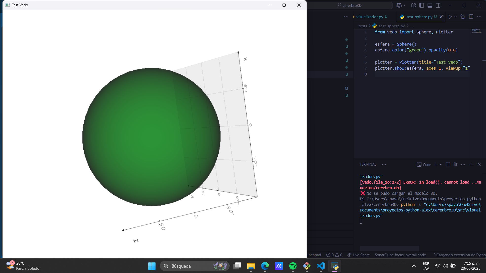

# 🧠 cerebro3D

**Visualizador en 3D de las regiones cognitivas del cerebro humano** usando Python y librerías especializadas como `vedo`, con el objetivo de explorar, aprender y representar gráficamente las áreas funcionales del cerebro.

---

## 🎯 Objetivo del proyecto

Este proyecto busca ofrecer una representación tridimensional del cerebro humano para:

- Visualizar zonas cognitivas clave como memoria, lenguaje, visión, emociones, etc.
- Comprender la estructura cerebral desde un enfoque computacional.
- Servir como base para modelos educativos, neurocientíficos o aplicaciones con inteligencia artificial.

---

## ⚙️ Tecnologías y librerías utilizadas

- [Python 3.x](https://www.python.org/)
- [Vedo](https://vedo.embl.es/) – Visualización 3D interactiva sobre VTK
- [VTK](https://vtk.org/) – Kit de herramientas de visualización
- `numpy`, `matplotlib` (complementarias)
- Formatos 3D: `.obj`, `.glb`, `.stl`

---

## 📂 Estructura del proyecto

```
cerebro3D/
├── modelos/               # Modelos 3D (.obj) del cerebro
│   └── cerebro.obj
├── src/                   # Código fuente principal
│   └── visualizador.py
├── tests/                 # Pruebas individuales (ej: test de renderizado)
│   └── test-sphere.py
├── docs/                  # Documentación futura
├── requirements.txt       # Dependencias del proyecto
├── README.md              # Este archivo
└── .gitignore             # Archivos excluidos del control de versiones
```

---

## 🚀 ¿Cómo ejecutar el visualizador?

1. Instala las dependencias:

```bash
pip install -r requirements.txt
```

2. Ejecuta el visualizador:

```bash
python src/visualizador.py
```

3. (Opcional) Ejecuta un test:

```bash
python tests/test-sphere.py
```

---

## 🖼 Vista previa

> Aún no cargamos el modelo cerebral, pero este es un ejemplo de prueba visualizada con `vedo`:



Próximamente se añadirá la visualización real del cerebro humano.

---

## 📌 Próximas funciones

- Cargar modelo real del cerebro humano (.obj)
- Etiquetas interactivas por región cognitiva
- Colores según función (memoria, lenguaje, etc.)
- Panel de información contextual
- Exportar capturas o rotaciones

---

## 🧠 Créditos

Creado por **AlexUnfinded** – Proyecto educativo y exploratorio para entender la relación entre programación, visualización 3D y neurociencia.

---

## 🛡 Licencia

Este proyecto está bajo la licencia **MIT**. Puedes usarlo, modificarlo y compartirlo libremente.

---

> Si te gusta el proyecto, ¡no olvides darle una ⭐ en GitHub!
